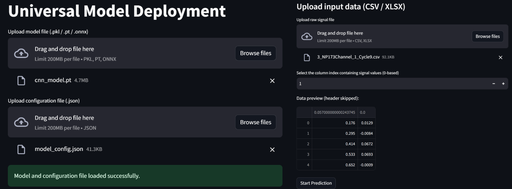
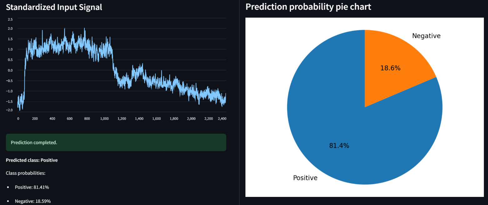

# Universal Model Deployment App

This is a universal model deployment tool based on Streamlit.

Users can upload their own pre-trained model files (`.pkl`, `.pt`, or `.onnx`) and corresponding configuration files (`.json`).  
After loading the model, you can drag and drop your pre-processed sample files (CSV or XLSX) to the app for real-time prediction and probability visualization.

- **Supports multiple model formats** (scikit-learn, PyTorch, ONNX)
- **Easy and intuitive interface** for rapid model inference
- **Designed for flexible deployment** in research or production

## How to use

1. **Upload your model file and configuration file.**
2. **Drag and drop your prepared sample data file for prediction.**
3. **View predicted classes and probability charts in real time.**

> *You need to provide your own trained model and config file. The app does not include any model training.*

---

## Screenshots

### Main UI

### Prediction Result

